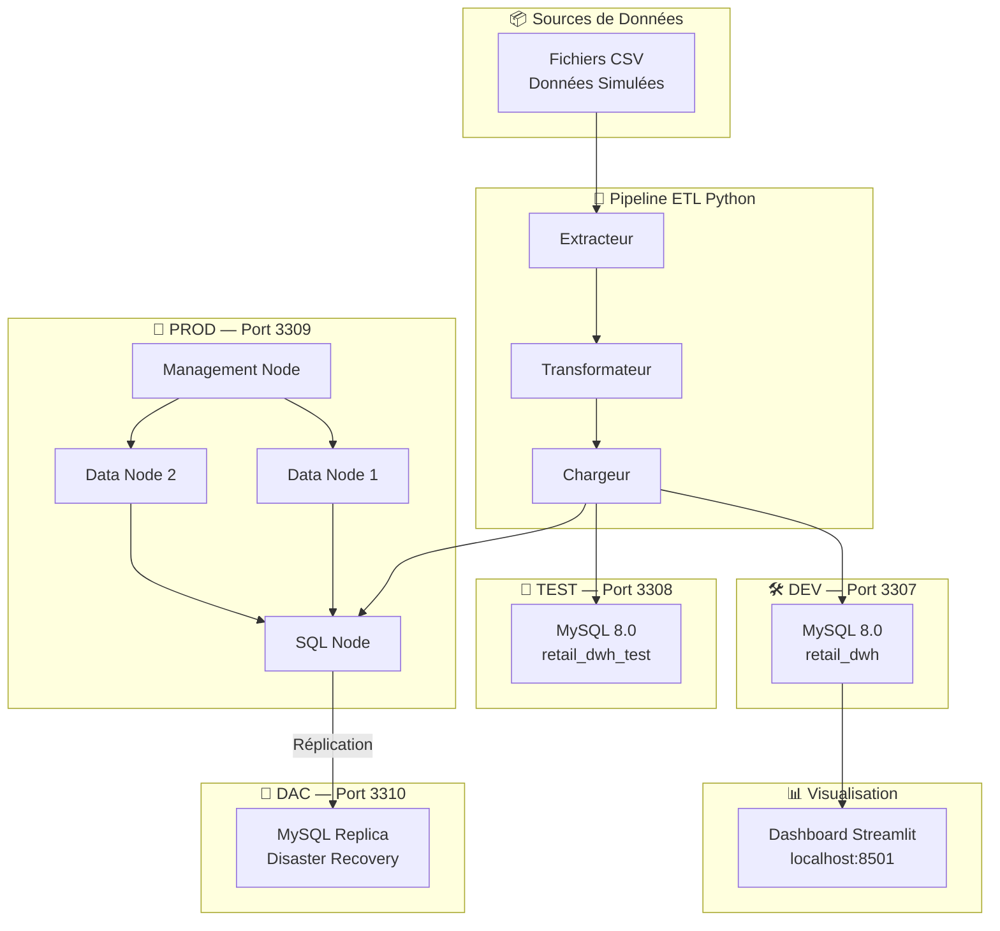

# Architecture Multi-Environnements — DWH Retail

## Vue Globale

## Description des Environnements

| Environnement | Port | Rôle | Technologie |
|---|---|---|---|
| DEV | 3307 | Développement & tests locaux | MySQL 8.0 Standard |
| TEST | 3308 | Validation & tests automatisés | MySQL 8.0 Standard |
| PROD | 3309 | Production — haute disponibilité | MySQL Cluster NDB |
| DAC | 3310 | Disaster Recovery & Analytics | MySQL Replica |

## Schéma en Étoile

- **1 Table de faits** : `fact_sales` (50 000 lignes)
- **5 Dimensions** : `dim_date`, `dim_product`, `dim_store`, `dim_customer`, `dim_promotion`
- **Granularité** : 1 ligne = 1 transaction de vente

## KPIs Implémentés

| KPI | Description | Page Dashboard |
|---|---|---|
| KPI A | Chiffre d'affaires par magasin | 🏪 CA Magasins |
| KPI B | Évolution mensuelle des ventes | 📈 Evolution Ventes |
| KPI C | Top 10 produits les plus vendus | 🏆 Top Produits |
| KPI D | Impact des promotions | 🎯 Promotions |
| KPI E | Panier moyen par segment client | 🛍️ Panier Moyen |