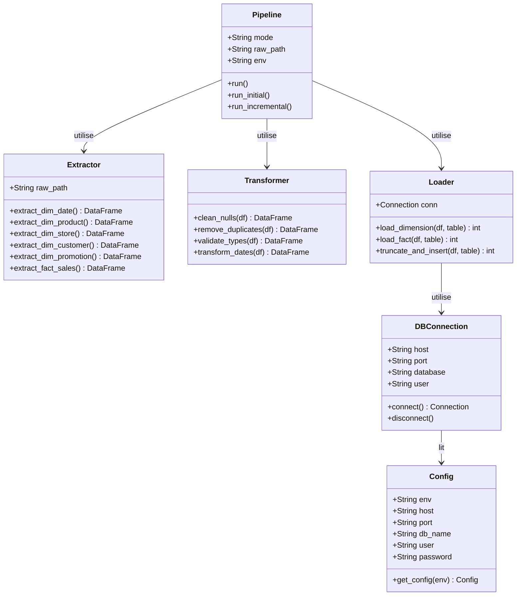

# Diagramme de Classes — Pipeline ETL

```mermaid
classDiagram
    class Pipeline {
        +String mode
        +String raw_path
        +String env
        +run()
        +run_initial()
        +run_incremental()
    }

    class Extractor {
        +String raw_path
        +extract_dim_date() DataFrame
        +extract_dim_product() DataFrame
        +extract_dim_store() DataFrame
        +extract_dim_customer() DataFrame
        +extract_dim_promotion() DataFrame
        +extract_fact_sales() DataFrame
    }

    class Transformer {
        +clean_nulls(df) DataFrame
        +remove_duplicates(df) DataFrame
        +validate_types(df) DataFrame
        +transform_dates(df) DataFrame
    }

    class Loader {
        +Connection conn
        +load_dimension(df, table) int
        +load_fact(df, table) int
        +truncate_and_insert(df, table) int
    }

    class DBConnection {
        +String host
        +String port
        +String database
        +String user
        +connect() Connection
        +disconnect()
    }

    class Config {
        +String env
        +String host
        +String port
        +String db_name
        +String user
        +String password
        +get_config(env) Config
    }

    Pipeline --> Extractor : utilise
    Pipeline --> Transformer : utilise
    Pipeline --> Loader : utilise
    Loader --> DBConnection : utilise
    DBConnection --> Config : lit
```
