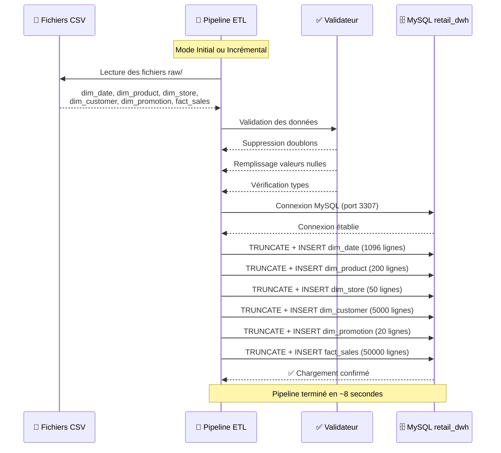

# Diagramme de Séquence — Pipeline ETL

```mermaid
sequenceDiagram
    participant CSV as 📁 Fichiers CSV
    participant ETL as 🐍 Pipeline ETL
    participant VAL as ✅ Validateur
    participant DB as 🗄️ MySQL retail_dwh

    Note over ETL: Mode Initial ou Incrémental

    ETL->>CSV: Lecture des fichiers raw/
    CSV-->>ETL: dim_date, dim_product, dim_store,<br/>dim_customer, dim_promotion, fact_sales

    ETL->>VAL: Validation des données
    VAL-->>ETL: Suppression doublons
    VAL-->>ETL: Remplissage valeurs nulles
    VAL-->>ETL: Vérification types

    ETL->>DB: Connexion MySQL (port 3307)
    DB-->>ETL: Connexion établie

    ETL->>DB: TRUNCATE + INSERT dim_date (1096 lignes)
    ETL->>DB: TRUNCATE + INSERT dim_product (200 lignes)
    ETL->>DB: TRUNCATE + INSERT dim_store (50 lignes)
    ETL->>DB: TRUNCATE + INSERT dim_customer (5000 lignes)
    ETL->>DB: TRUNCATE + INSERT dim_promotion (20 lignes)
    ETL->>DB: TRUNCATE + INSERT fact_sales (50000 lignes)

    DB-->>ETL: ✅ Chargement confirmé

    Note over ETL,DB: Pipeline terminé en ~8 secondes
```