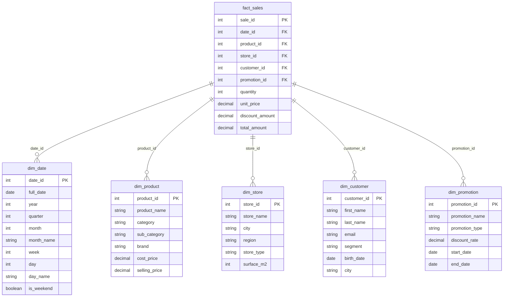

# Schéma en Étoile — DWH Retail

```mermaid
erDiagram
    fact_sales {
        int sale_id PK
        int date_id FK
        int product_id FK
        int store_id FK
        int customer_id FK
        int promotion_id FK
        int quantity
        decimal unit_price
        decimal discount_amount
        decimal total_amount
    }

    dim_date {
        int date_id PK
        date full_date
        int year
        int quarter
        int month
        string month_name
        int week
        int day
        string day_name
        boolean is_weekend
    }

    dim_product {
        int product_id PK
        string product_name
        string category
        string sub_category
        string brand
        decimal cost_price
        decimal selling_price
    }

    dim_store {
        int store_id PK
        string store_name
        string city
        string region
        string store_type
        int surface_m2
    }

    dim_customer {
        int customer_id PK
        string first_name
        string last_name
        string email
        string segment
        date birth_date
        string city
    }

    dim_promotion {
        int promotion_id PK
        string promotion_name
        string promotion_type
        decimal discount_rate
        date start_date
        date end_date
    }

    fact_sales ||--o{ dim_date : "date_id"
    fact_sales ||--o{ dim_product : "product_id"
    fact_sales ||--o{ dim_store : "store_id"
    fact_sales ||--o{ dim_customer : "customer_id"
    fact_sales ||--o{ dim_promotion : "promotion_id"
```